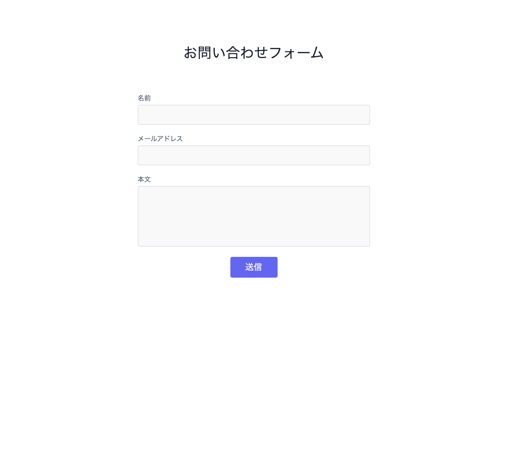
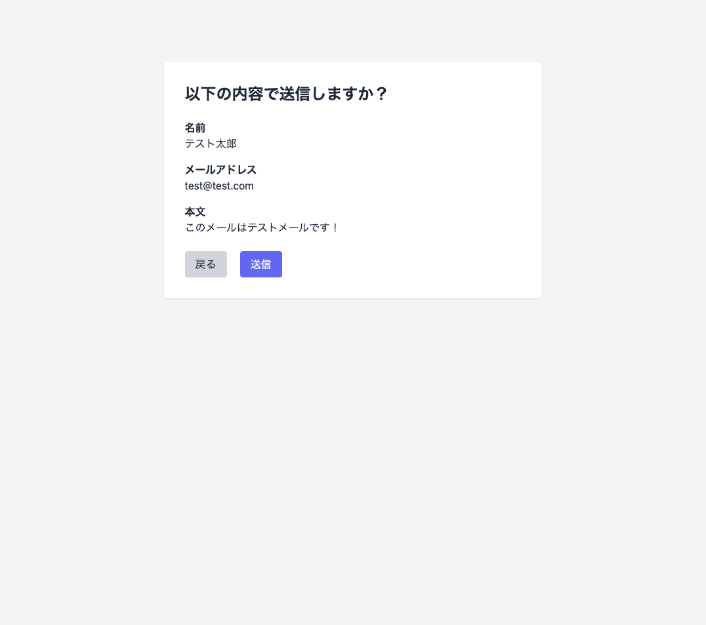
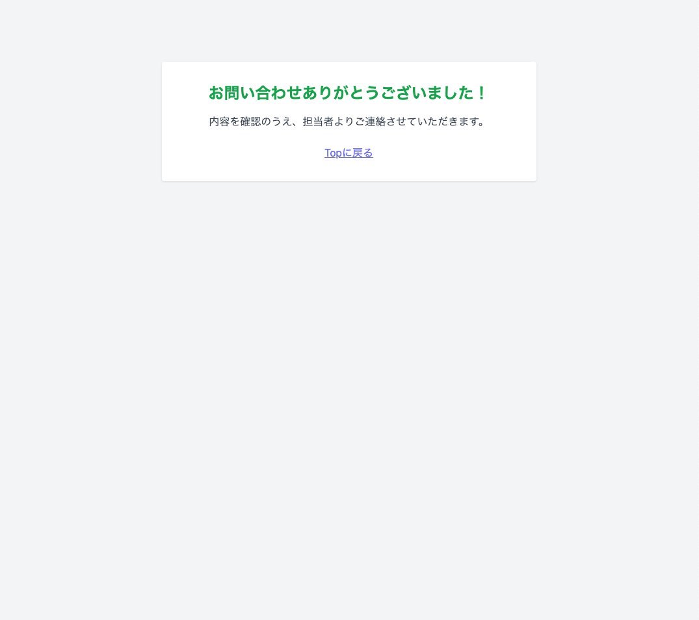

# お問い合わせメール送信アプリ / Contact Form Mail App

このアプリは Laravel を使用して作成した、お問い合わせメール送信フォームです。  
企業のホームページに設置されているお問い合わせフォームをイメージして構築しました。  
送信確認画面や控えメール（自動返信）など、実務でもよく使われる機能を実装しています。

This is a simple contact form application built with Laravel.  
It simulates a typical inquiry form on a company’s website.  
It includes practical features like input validation, confirmation screen, and auto-reply mail.

---

## ✅ 主な機能 / Features

- 入力フォーム（名前・メール・メッセージ）
- バリデーション（エラー表示・再表示対応）
- フラッシュメッセージ
- 送信確認画面
- サンクスページ
- 管理者へのメール送信
- ユーザーへの控えメール（自動返信）

---

## 🛠️ 使用技術 / Technologies

- Laravel 10
- PHP 8.2
- Tailwind CSS（CDN版）
- SMTP メール送信（ロリポップサーバー）
- Git / GitHub によるバージョン管理

---

📫 作者 / Author
Shoma（@CodeByShoma）

GitHub: https://github.com/CodeByShoma

